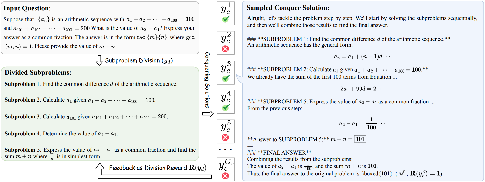

<h1 align="center">
Training LLMs for Divide-and-Conquer Reasoning Elevates Test-Time Scalability
</h1>

<div align="center">


</div>

<p align="center">
  <a href="https://arxiv.org/abs/2602.02477"><b>[📜 Paper]</b></a> •
  <a href="https://github.com/MasterVito/DAC-RL"><b>[🐱 GitHub]</b></a> •
  <a href=""><b>[🐦 Twitter]</b></a> •
  <a href=""><b>[📕 Rednote]</b></a>
</p>


<!-- <p align="center">
Repo for "<a href="https://arxiv.org/pdf/2508.14029v1" target="_blank">Beyond Pass@1: Self-Play with Variational Problem Synthesis Sustains RLVR</a>"
</p> -->


<p align="center">
    
        <br>
    <em>Figure 1: An overview of the DAC-style inference and reward assignments in training, illustrated with a case study.
    </em>
</p>

---

## 💡 Introduction 

**What this repo does:** it trains LLMs to *think in a divide-and-conquer (DAC) way* via an end-to-end RL pipeline.

**Core idea:** instead of only learning *sequential* chain-of-thought (CoT), the policy learns to:
1) **Divide** a hard problem into structured subproblems, then
2) **Conquer**: solve subproblems and finally solve the original problem conditioned on those solutions.

**Why it matters:** CoT is strictly sequential and can hit a ceiling on very hard problems. DAC offers stronger *test-time scalability* by enabling structured exploration through decomposition.

<!-- <br> -->

## 🔥 News

<!-- - [2023/10/13] 🔥🔥🔥 We release a demo for ToRA at [🐯 Gradio](https://9557c5365a6f44dc84.gradio.live), try it out!!! -->
<!-- - [2023/06/13] We release all prompts used in the SwS framework in <a href="https://github.com/MasterVito/SwS/tree/master/prompts"><b>prompts</b></a>.
- [2023/06/13] We update the demo set of synthetic problems from SwS in <a href="https://github.com/MasterVito/SwS/tree/master/datasets"><b>datasets</b></a>, including 500 samples for each model and category. You can also find them in <a href="https://huggingface.co/datasets/MasterVito/SwS-Demo-Dataset"><b>Demo Dataset</b></a>. -->
<!-- - [2025/12/13] 🔥🔥🔥 **We open-sourced three SvS model checkpoints at different scales, along with an additional 7B checkpoint for coding tasks, available at <a href="https://huggingface.co/RLVR-SvS"><b>[Models]</b></a>. Training parquet data are attached in the respective repos.**
- [2025/08/25] **We provide the full code for training and evaluation for SvS.**
- [2025/08/19] **Our full code and datasets are under review by Microsoft and will be released upon approval.** -->
- [2026/02/02] DAC-RL paper and repo are released.

<!-- <br> -->

## 🔍 Method Overview (DAC-RL)

At a high level, DAC-RL alternates between two *roles* (not necessarily two separate models):

- **Divide stage**: generate *subproblems* with a strict tag format.
- **Conquer stage**: solve subproblems sequentially and then solve the original problem, outputting a final boxed answer.

The repo implements this as a single training loop that creates two rollout batches per iteration (**divide** and **conquer**) and assigns rewards to both.


```
flowchart TD
  Q[Original question] --> D[Divide prompt: propose subproblems]
  D --> S[Parse & validate subproblems]
  S --> C[Conquer prompt: solve subproblems then original]
  C --> R[Rule-based verifier: answer correctness]
  R --> RC[Conquer reward]
  RC --> RD[Divide reward (derived from conquer outcomes)]
  RC --> PPO[PPO/GRPO-style policy update]
  RD --> PPO
```


<!-- ## 💡 Introduction 
We propose an end-to-end reinforcement learning framework that trains LLMs to perform divide-and-conquer (DAC) reasoning, which substantially improves downstream performance and test-time scalability on challenging reasoning tasks. -->

---

## 📊 Experiments on <a href="https://huggingface.co/Qwen/Qwen3-4B-Instruct-2507">Qwen3-4B-Instruct-2507</a>

| Model | AIME 2024 | AIME 2025 | Beyond-AIME | HMMT 2025 | Average |
|---|---:|---:|---:|---:|---:|
| Init-CoT (Pass@1/32) | 62.6 / 90.0 | 45.7 / 76.7 | 32.1 / 65.0 | 30.3 / 56.7 | 42.7 / 72.1 |
| Init-DAC (Pass@1/32) | 59.6 / 90.0 | 43.2 / 73.3 | 29.6 / 61.0 | 28.2 / 63.3 | 40.2 / 71.9 |
| RL-CoT (Pass@1/32) | 45.9 / 85.8 | 52.1 / 77.4 | 30.4 / 58.1 | 21.8 / 54.4 | 37.5 / 69.0 |
| **RL-DAC (Pass@1/32)** | **63.9 / 87.7** | **54.2 / 78.8** | **34.6 / 67.9** | **31.9 / 66.6** | **46.1 / 75.3** |

---

## 🚀 Quick Start

### ⚙️ Setup

We recommend using [Conda](https://docs.conda.io/projects/miniconda) to manage your environment. We use [vLLM](https://github.com/vllm-project/vllm) (0.10.1.1) to accelerate inference. Run the following commands to setup your environment:

```sh
conda create -n svs python=3.10.16
conda activate svs
pip install torch==2.7.1 --index-url https://download.pytorch.org/whl/cu128 # CUDA 12.6 for example
pip install -r requirements.txt
```

---

### 📦 Data Preparation

#### Evaluation benchmark (included)

The provided benchmark is [data/dac-rl-benchmarks.jsonl](data/dac-rl-benchmarks.jsonl).

Each line is a JSON object with keys:
- `question`: the problem statement
- `ref_answer`: the reference final answer
- `data_source`: benchmark name (e.g., `AIME-2024-30`, `AIME-2025-30`, ...)

#### Training dataset (external)

The training script expects a parquet like `data/DAPO-Math-17k.parquet`. One simple way to download & save as parquet:

```bash
python - <<'PY'
from datasets import load_dataset
import pandas as pd

ds = load_dataset('BytedTsinghua-SIA/DAPO-Math-17k')
# Adjust split names if needed.
train = ds['train'].to_pandas()
train.to_parquet('data/DAPO-Math-17k.parquet', index=False)
print('saved:', 'data/DAPO-Math-17k.parquet', 'rows:', len(train))
PY
```

---

### 🪁 Evaluation

We provide evaluation scripts for both **CoT** and **DAC** inference. To use them, simply configure the `model_name_or_path` (default: `Qwen/Qwen3-4B-Instruct-2507`) and the `data_path` (by default, AIME 24, AIME 25, Beyond-AIME, and HMMT-25 are used for evaluation, as described in the paper) in [`scripts/eval_cot.sh`](scripts/eval_cot.sh) and [`scripts/eval_dac.sh`](scripts/eval_dac.sh), and then run the following command:


```sh
bash scripts/eval_cot.sh # Evaluate model performance using chain-of-thought prompting
bash scripts/eval_dac.sh # Evaluate model performance using divide-and-conquer style reasoning
```

DAC evaluation does two-stage generation:
1) divide prompt → generate subproblems
2) conquer prompt → solve and answer original
---

### ⚡️ Training

We also present our complete training scripts, where the core implementation is the `RayDACTrainer` class in the `verl/trainer/ppo/ray_trainer.py` file. We provide the training data used in our paper in [data](data). 
For example, to train the <a href="https://huggingface.co/Qwen/Qwen3-4B-Instruct-2507">Qwen3-4B-Instruct-2507</a> model, run the following command:

```sh
bash scripts/run_dac_training.sh
```
**Which file implements DAC training?** - [verl/trainer/ppo/ray_trainer.py](verl/trainer/ppo/ray_trainer.py) → `RayDACTrainer`.

DAC-specific reward controls: These parameters directly encode the paper’s training-time alignment to DAC inference.

| Config key | Default (in config) | Used in | What it does | Practical notes |
|---|---:|---|---|---|
| `data.divide_reward_setting` | `"format"` | training | How to reward the **divide** stage. Options implemented: `format`, `any_accuracy`, `average_accuracy` | `format` rewards producing valid subproblem structure; `any_accuracy` is stricter/competition-aware; `average_accuracy` gives graded signal but can be noisier. |
| `data.conquer_reward_setting` | `"answer"` | training | How to reward the **conquer** stage. Options: `answer`, `answer_and_format` | `answer_and_format` additionally enforces that the response follows subproblem order/structure, which stabilizes DAC behavior but may reduce reward early. |
| `data.stop_divide` | `false` | training | If `true`, only train on conquer samples (ignore divide samples) | Useful for ablations; for full DAC-RL keep `false`. |
| `data.max_prompt_length` | `4096` | training | Max tokens for prompts (after chat template) | Must accommodate divide/conquer prompts. Overlong samples are filtered. |
| `data.max_response_length` | `8192` | training | Max generation tokens during rollouts | DAC often benefits from longer outputs (esp. conquer stage). |


---

## ☕️ Citation

If you find this repository helpful, please consider citing our paper:

```bibtex
@misc{liang2026trainingllmsdivideandconquerreasoning,
      title={Training LLMs for Divide-and-Conquer Reasoning Elevates Test-Time Scalability}, 
      author={Xiao Liang and Zhong-Zhi Li and Zhenghao Lin and Eric Hancheng Jiang and Hengyuan Zhang and Yelong Shen and Kai-Wei Chang and Ying Nian Wu and Yeyun Gong and Weizhu Chen},
      year={2026},
      eprint={2602.02477},
      archivePrefix={arXiv},
      primaryClass={cs.CL},
      url={https://arxiv.org/abs/2602.02477}, 
}
```
---

## 📄 License

This project is released under the **Apache License 2.0**. See [LICENSE](LICENSE).

## 🌟 Star History

[](https://star-history.com/#mastervito/DAC-RL&Date)
